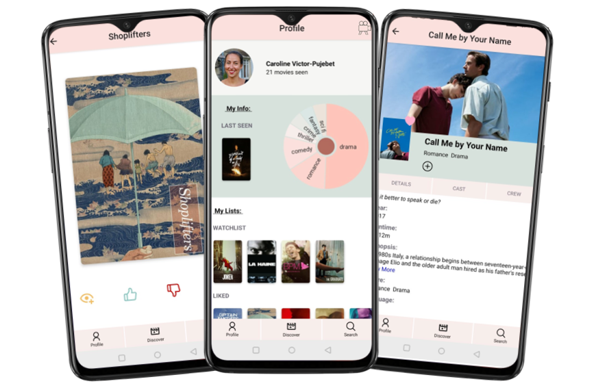

# lux

lux is a mobile application that allows users to search and store movies. Each movie displays details, as well as recommendations for similar movies.

Users are able to make lists of movies based on their opinion about the movie (liked, disliked, favourite), or they can add it to their watchlist to come back to it later.
They can find inspiration in the discover section.

lux was created using the Movie-DB api.

## Screenshots

## Getting started

These instruction will help you setup a local development instance of the app.

### get the repo

`git clone https://github.com/Carolinevp/lux.git`

### Setup

You need to create a `config.js` file in `/Client`, follow the format of `config-example` and replace 'YOUR IP ADDRESS' with your own IP address.

To be able to open the App, you need to either download the Expo Go app on your mobile or have the Android Studio installed in your computer.

2 separate installations are required: one for the backend and one for the frontend.

#### Backend

Install MongoDB and have it running in the default port.
Go to the `/Back-End` and run:

- `npm i`

#### FrontEnd

Go to the `/Client` and run `npm i`.

### Start the App

From the root folder of the project change into `/Back-End and `npm start

From the root folder of the project change into `/Client` and `npm start`

## Tech-Stack

### Frontend

- [JavaScript](https://www.typescriptlang.org)
- [React Native](https://reactnative.dev/) with [Expo](https://expo.io/)

### Backend

- [Node.js](https://nodejs.org/)
- [Express](https://expressjs.com)
- [MongoDB](https://www.mongodb.com)
- [Mongoose](https://mongoosejs.com)

### API

- [Movie DB](https://www.themoviedb.org/documentation/api)

